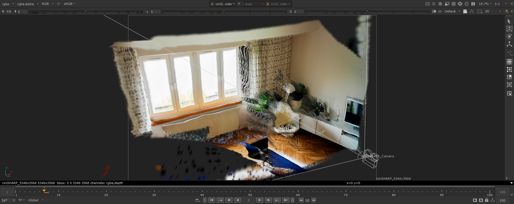
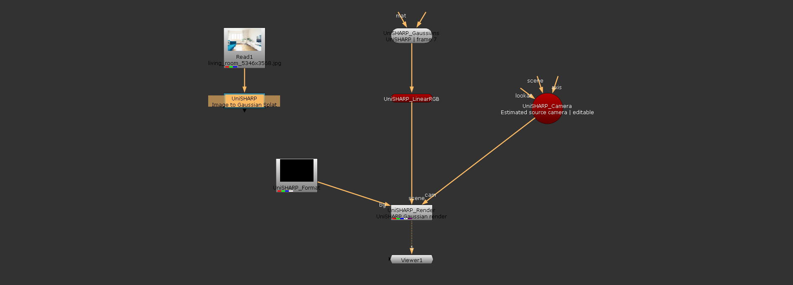
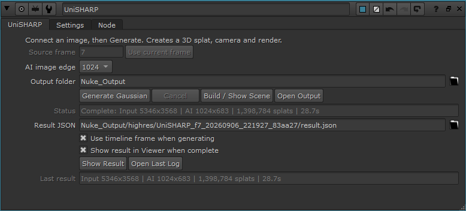
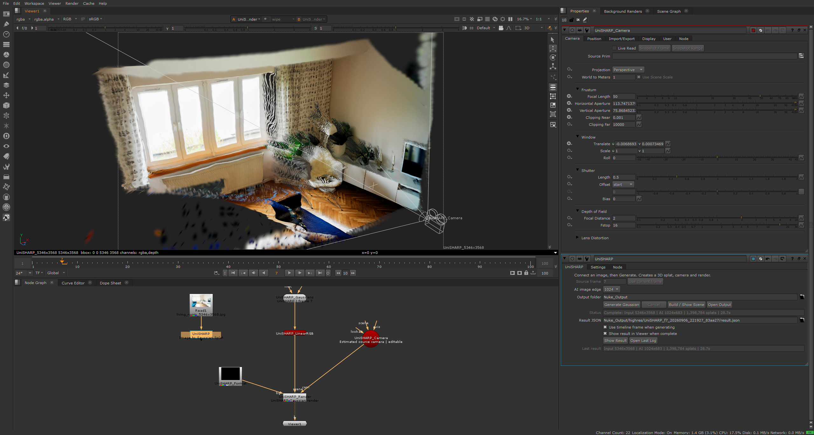
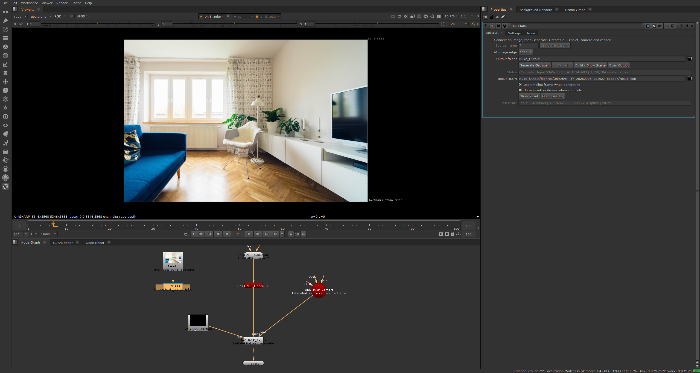

[한국어](README.md) | [English](README.en.md)

# UniSHARP for Nuke

**이미지 한 장을 3D Gaussian Splat으로 만들고, Nuke 17 안에서 카메라를 움직이며 렌더하는 로컬 도구입니다.**

[UniSHARP](https://github.com/Insta360-Research-Team/UniSHARP)의 단일 이미지 복원을 Nuke 노드 작업 흐름에 연결했습니다. Nuke에는 Python 제어 노드를 추가하고, AI 추론은 별도의 Python 프로세스에서 실행합니다. 생성 결과는 Nuke 17의 기본 3D 노드로 읽고 렌더합니다.

현재 버전: **1.1.4** · Windows용 설치 스크립트 제공 · Nuke **17.0v3**에서 검증



*한 장의 사진에서 생성한 Gaussian 장면을 Nuke의 3D Viewer에서 확인한 화면입니다.*

## 무엇을 할 수 있나요?

- 연결된 이미지에서 프레임 한 장을 저장하고 UniSHARP로 3D Gaussian을 생성합니다.
- 추정한 원본 카메라와 편집 가능한 Nuke 3D 장면을 만듭니다.
- 생성한 장면에서 카메라 위치와 회전을 조정하고 `SplatRender`로 렌더합니다.
- 진행 단계·경과 시간·AI 처리 크기와 최근 결과 통계를 노드에서 확인합니다.
- 같은 결과의 장면을 다시 표시할 때 기존 노드와 카메라 편집을 유지합니다.
- 새로운 생성을 실행하면 별도의 결과 폴더와 장면 버전을 추가합니다.

**입력 이미지 → UniSHARP 제어 노드 → 외부 Python 추론 → Gaussian PLY + 카메라 정보 → Nuke 3D 장면** 순서로 동작합니다. 이 Nuke 작업 흐름에는 Blender, Unreal Engine, 브라우저 UI가 필요하지 않습니다.



*`GeoReference`, `GeoColorSpace`, `Camera4`, `SplatRender`와 출력 크기를 설정하는 투명 `Constant`가 생성됩니다. OCIO 프로젝트에는 작업 색 공간 변환 노드가 추가됩니다.*

> **제어 노드의 2D 출력은 입력 이미지를 그대로 통과시킵니다.** 생성된 이미지 출력은 별도로 만들어지는 `SplatRender` 또는 그 뒤의 `UniSHARP_WorkingSpace`에서 확인합니다.

## 요구 사항

| 항목 | 내용 |
|---|---|
| 운영체제 | Windows 64-bit. 설치·제거 스크립트는 PowerShell용입니다. |
| Nuke | Nuke 17. **17.0v3**에서 실제 생성·렌더를 확인했습니다. |
| Python | Nuke 외부의 **64-bit Python 3.11** |
| AI 환경 | 검증 구성: **PyTorch 2.8.0 + CUDA 12.8**, torchvision 0.23.0 |
| GPU | CUDA를 사용할 수 있는 NVIDIA GPU. **RTX 3070 8 GB**에서 검증했습니다. |
| 모델 | 공식 `pretained_model.pt`, 약 **4.73 GB**, 별도 다운로드 |
| 저장 공간 | 모델 외에도 Python 환경, 입력 스냅샷, PLY와 렌더 결과를 저장할 공간이 필요합니다. |

Nuke 내장 Python에 PyTorch를 설치하지 않습니다. 모델 가중치, 가상환경, Nuke 설치 파일은 이 저장소에 포함되어 있지 않습니다. 기본 추론 설정은 **AI image edge 512**입니다.

## 설치

### 1. 저장소 받기

GitHub의 **Code → Download ZIP**으로 다운로드해 압축을 풀거나 다음 명령을 실행합니다.

```powershell
git clone https://github.com/tardis7732/UniSHARP-for-Nuke.git
cd UniSHARP-for-Nuke
```

이후 명령은 저장소 폴더에서 실행합니다. 설치 후에도 이 폴더를 계속 보관하세요.

### 2. 외부 Python 환경 만들기

Python 3.11이 설치된 상태에서 다음 명령을 순서대로 실행합니다. 각 명령이 성공한 뒤 다음 단계로 진행하세요.

```powershell
py -3.11 -m venv .venv-nuke
& ".\.venv-nuke\Scripts\python.exe" -m pip install --upgrade pip
& ".\.venv-nuke\Scripts\python.exe" -m pip install torch==2.8.0 torchvision==0.23.0 --index-url https://download.pytorch.org/whl/cu128
& ".\.venv-nuke\Scripts\python.exe" -m pip install -r .\nuke\requirements-nuke.txt
```

`py` 명령을 사용할 수 없으면 첫 줄의 `py -3.11`을 설치한 Python 3.11 실행 파일 경로로 바꿉니다. 예: `& "C:\Python311\python.exe" -m venv .venv-nuke`.

### 3. 모델 다운로드

```powershell
& ".\.venv-nuke\Scripts\python.exe" .\nuke\download_checkpoint.py
```

공식 [Insta360-Research/Unisharp](https://huggingface.co/Insta360-Research/Unisharp) 배포처에서 `checkpoints/pretained_model.pt`를 내려받고 SHA-256을 확인합니다. 파일명 `pretained_model.pt`는 원본 배포본의 표기입니다. 다운로드 출처·리비전·해시는 로컬 `checkpoints/source.json`에 기록됩니다.

### 4. Nuke에 등록

**`Install_Nuke17.bat`을 더블클릭**합니다. 또는 다음 명령을 실행합니다.

```powershell
powershell.exe -NoProfile -ExecutionPolicy Bypass -File .\Install_Nuke17.ps1 -PythonExe ".\.venv-nuke\Scripts\python.exe"
```

설치기는 실행 환경과 모델 경로를 확인하고 사용자 `.nuke/init.py`에 플러그인 경로를 등록합니다. 기존 내용은 유지하고 변경 전 파일을 백업합니다. 동일한 설치를 반복해도 등록 블록은 중복되지 않습니다.

이미 열어 둔 Nuke를 다시 시작한 다음 **Nodes → UniSHARP → UniSHARP (Nuke 17)**에서 노드를 만듭니다. 설치 후 새로 실행한 Nuke에는 바로 로드됩니다.

### 기존 Python 환경·모델 재사용

UniSHARP 추론에 필요한 패키지가 있는 외부 환경과 모델을 경로로 지정할 수 있습니다. 기존 환경의 패키지를 자동으로 다시 설치하지 않습니다.

```powershell
powershell.exe -NoProfile -ExecutionPolicy Bypass -File .\Install_Nuke17.ps1 -PythonExe "D:\AI\UniSHARP\.venv\Scripts\python.exe" -Checkpoint "D:\Models\pretained_model.pt"
```

새 가상환경이 필요하고 모델은 이미 있다면 `-CreateEnvironment -BasePythonExe "C:\Python311\python.exe" -Checkpoint "D:\Models\pretained_model.pt"` 옵션도 사용할 수 있습니다. 이 옵션은 저장소 안에 `.venv-nuke`를 만들고 패키지를 설치합니다. 모델은 자동 다운로드하지 않으므로 없는 경우 위의 다운로드 단계를 먼저 준비하세요.

설정은 로컬 `nuke/config.json`에 저장됩니다. 다른 `.nuke` 폴더를 사용하는 환경은 설치·제거 명령에 `-NukeUserDir "D:\NukeConfig\.nuke"`를 추가합니다.

## 사용 방법

1. `Read` 등 이미지 노드를 **UniSHARP의 입력 0**에 연결합니다.
2. 타임라인을 처리할 프레임으로 옮깁니다. 새 노드는 생성 버튼을 누르는 시점의 타임라인 프레임을 사용합니다.
3. **AI image edge**를 선택합니다. 처음에는 **512**로 시작하세요.
4. **Output folder** 아래 줄의 **Generate Gaussian**을 누릅니다.
5. 진행 상태를 확인합니다. 완료되면 생성 결과가 Viewer에 표시됩니다.
6. 생성된 `Camera4`를 조정해 시점을 바꾸고 결과 출력에 `Write`를 연결해 렌더합니다.

Viewer에는 **생성 결과만 자동 연결**합니다. 원본 이미지를 B 입력에 자동으로 연결하는 기능은 없습니다.



*제어 노드의 속성 화면입니다. `Result JSON` 필드는 표시되며, 생성에 성공하면 결과 경로가 자동 입력됩니다.*

### 입력과 주요 설정

| 입력·설정 | 동작 |
|---|---|
| 입력 0 | 처리할 2D 이미지. 일반 원근 사진, 정사각형 픽셀 비율 1을 사용합니다. |
| Use timeline frame when generating | 기본 켜짐. Generate를 누를 때의 타임라인 프레임을 처리합니다. |
| Source frame | 위 옵션을 끄면 편집할 수 있는 고정 프레임 번호입니다. |
| Use current frame | 고정 프레임 모드에서 현재 타임라인 번호를 Source frame에 복사합니다. |
| AI image edge | AI 처리용 긴 변 크기: **512 / 768 / 1024**. |
| Output folder | 생성 결과 저장 위치. 설치 기본값은 저장소의 `Nuke_Output`입니다. |
| Generate Gaussian | 프레임 한 장으로 새로운 결과와 별도의 장면을 생성합니다. |
| Cancel | 실행 중인 작업을 중단합니다. 이미 저장한 입력과 로그는 남습니다. |
| Build / Show Scene | Result JSON에 지정한 결과의 장면을 만들거나 기존 장면을 다시 사용합니다. |
| Show Result | 결과 장면을 Viewer에 표시합니다. |
| Show result in Viewer when complete | 기본 켜짐. 생성 완료 시 Viewer를 결과에 연결합니다. |
| Open Output / Open Last Log | 가장 최근에 시도한 작업 폴더와 로그를 엽니다. 실패한 작업도 확인할 수 있습니다. |
| Status / Last result | 처리 단계·경과 시간과 최근 결과의 원본/AI 크기·Gaussian 수·실행 시간입니다. |
| Result JSON | 자동 입력되는 결과 파일 경로. 저장된 다른 `result.json`을 선택해 장면을 불러올 수도 있습니다. |

**Settings** 탭에서 외부 Python 실행 파일, 모델 경로, `cuda`/`cpu`를 선택할 수 있습니다. `Check Environment`는 패키지·장치·모델 파일 상태를 확인하며 이미지 생성을 실행하지 않습니다. CPU 선택 옵션은 제공되지만, 공개한 벤치마크와 실제 실행 검증은 **CUDA 기준**입니다.

### 장면과 결과 보관



*생성된 `Camera4`에는 추정 카메라 값이 들어갑니다. `Position` 탭의 위치·회전을 조정해 시점을 바꾸고, `SplatRender`에서 결과를 확인할 수 있습니다.*

같은 결과에 대해 **Build / Show Scene**이나 **Show Result**를 다시 누르면 이 플러그인이 태그한 기존 장면을 재사용합니다. 노드 이름 변경과 `.nk` 재열기 후에도 편집한 카메라를 보존합니다. **새 Generate는 별도의 장면을 추가**해 이전 결과와 편집 내용을 남깁니다.

각 결과 폴더에는 입력 이미지, `gaussians.ply`, `camera.json`, `result.json`, 진행 정보와 `worker.log`가 저장됩니다. `.nk` 파일과 함께 이 폴더를 보관하세요. 결과 JSON은 장면 재구성에 필요합니다.

다른 위치나 PC로 이동하면 Python·모델 경로와 `.nk`의 파일 참조를 확인해야 합니다. `Result JSON` 경로뿐 아니라 JSON 안의 PLY 경로도 새 위치와 맞아야 합니다. 가상환경은 새 PC의 Python·GPU 환경에 맞춰 구성하세요.

### 플러그인 새로 고침·제거

코드를 갱신한 뒤 **Nodes → UniSHARP → Reload Plugin**으로 다시 불러올 수 있습니다. 진행 중인 작업이 끝난 뒤 실행하세요. 해당 메뉴가 없는 이전 버전을 이미 열어 두었다면 Nuke를 한 번 재시작합니다. 이전 제어 노드는 고정 프레임을 유지하고 추가 기능을 **Workflow** 탭에 표시합니다.

제거는 다음 명령으로 자체 시작 등록 블록만 지웁니다. 모델·가상환경·생성 결과는 보관됩니다.

```powershell
powershell.exe -NoProfile -ExecutionPolicy Bypass -File .\Uninstall_Nuke17.ps1
```

## 해상도와 검증 결과

**AI image edge와 최종 출력 크기는 다릅니다.** 5346×3568 사진에 1024를 선택하면 AI는 1024×683 크기로 처리하고 Nuke는 5346×3568 크기로 렌더합니다. 추론 카메라는 원본 출력 크기에 맞춰 환산합니다.



*생성한 Gaussian 장면을 Nuke의 SplatRender로 렌더한 화면입니다.*

같은 **5346×3568** 원본 사진을 사용한 실제 측정값입니다. 환경은 **Windows, Nuke 17.0v3, RTX 3070 8 GB, Python 3.11, PyTorch 2.8.0 + CUDA 12.8**입니다.

| AI image edge | 실제 AI 크기 | Gaussian 수 | worker 실행 시간 | PyTorch 피크 할당 |
|---|---|---:|---:|---:|
| 512 | 512×342 | 350,208 | 12.703초 | 3.77 GiB |
| 1024 | 1024×683 | 1,398,784 | 28.719초 | 7.62 GiB |

worker 시간에는 모델 준비와 추론·파일 저장이 포함됩니다. Nuke 입력 저장과 최종 렌더를 포함한 전체 대기 시간은 더 깁니다. 수치는 이 사진과 검증 장비에서의 참고값입니다.

Nuke 안에서 입력 프레임 저장, 외부 CUDA 추론, PLY 읽기, 네이티브 렌더, 카메라 이동, 저장·재열기와 카메라 편집 보존을 확인했습니다. OCIO 기본 설정과 ACES 1.3·2.0의 출력 변환도 검증했습니다.

측정값과 공개 패키지 확인 결과는 [검증 기록](docs/validation.json)에 정리했습니다.

## 제한 사항과 문제 해결

- **한 번에 프레임 한 장**을 처리합니다. 시간적으로 일관된 시퀀스 생성, 4D 복원, 실시간 프레임 처리는 지원하지 않습니다.
- 한 장에서 보이지 않는 뒷면이나 가려진 구조에는 복원 근거가 부족합니다. 원본 카메라 근처의 작은 시점 이동부터 확인하세요.
- 입력은 **8-bit sRGB PNG**로 저장하며 알파를 사용하지 않습니다. HDR 범위나 원본의 모든 채널을 유지하는 추론 경로가 아닙니다.
- 일반 원근 이미지를 대상으로 합니다. 어안·파노라마 UI는 포함하지 않습니다. 픽셀 비율이 1이 아니면 앞에 `Reformat`을 연결하세요.
- 큰 출력 PNG가 원본 크기의 세부 복원을 뜻하지는 않습니다. 위 1024 실행의 내부 특징 추출 크기는 **602×406**이었습니다. 5K 출력은 네이티브 5K 모델 추론을 의미하지 않습니다.
- 1024는 RTX 3070 8 GB에서 메모리 여유가 작았습니다. 기본값 512를 유지하고 메모리 부족 시 다른 GPU 작업을 종료하세요. PyTorch 피크 할당·예약 통계는 전체 프로세스의 실제 상주 VRAM 측정과 구분됩니다.
- 생성 실패 시 **Status**와 **Open Last Log**를 먼저 확인합니다. Python 경로, 체크포인트, CUDA 사용 가능 여부를 `Check Environment`로 점검할 수 있습니다.
- 사용자 OCIO 설정에는 sRGB 입력 변환과 Linear Rec.709 출력 변환에 필요한 색 공간이 있어야 합니다. 사용자 정의 설정 전체에 대한 호환성을 보장하지 않습니다.
- 현재 검증 범위는 Windows/Nuke 17.0v3입니다. 다른 운영체제와 Nuke 버전은 별도 검증이 필요합니다.

## 출처와 라이선스

이 프로젝트는 비공식 Nuke 연동 도구입니다. 원본 연구 코드와 기존 로컬 워크플로우의 저작자·고지를 유지합니다.

| 구성요소 | 출처 | 라이선스 |
|---|---|---|
| UniSHARP 및 저장소 루트 | [Insta360 Research Team / UniSHARP](https://github.com/Insta360-Research-Team/UniSHARP) | [CC BY-NC 4.0](LICENSE) |
| UniK3D | [lpiccinelli-eth / UniK3D](https://github.com/lpiccinelli-eth/UniK3D) | [CC BY-NC-SA 4.0](UniK3D/LICENSE) |
| Nuke 변형의 기반 로컬 워크플로우 | [tardis7732 / UniSHARP-Blender-Workflow](https://github.com/tardis7732/UniSHARP-Blender-Workflow) | 포함된 원본 라이선스·고지 유지 |

**비상업 조건이 적용됩니다.** 구성요소별 고지는 [THIRD_PARTY_NOTICES.md](THIRD_PARTY_NOTICES.md)를 참고하세요. 별도로 내려받는 모델과 설치 패키지에는 각 배포처의 조건이 적용됩니다.

스크린샷의 예제 사진: **Jaroslaw Ceborski**, [Wikimedia Commons의 Living room (Unsplash)](https://commons.wikimedia.org/wiki/File:Living_room_(Unsplash).jpg), [원본 Unsplash 사진](https://unsplash.com/photos/jn7uVeCdf6U). Commons 파일 페이지의 **CC0 1.0** 표기를 따릅니다. 스크린샷은 실제 Nuke 실행 화면이며 원본 사진과 모델은 저장소 배포물에 포함되지 않습니다.
